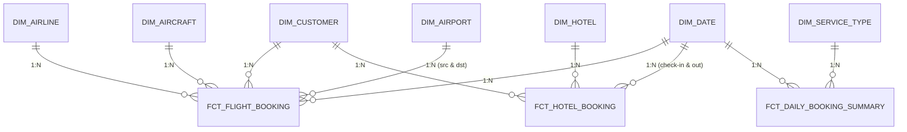

## Step #2 — Designing Data Warehouse Model

### 1. Modeling Approach
Model arsitektur yang dipilih untuk *layer* final Data Warehouse adalah **Star Schema**. 

**Alasan Pemilihan Star Schema:**
* Sangat optimal untuk kebutuhan analitik dan *reporting* (karena agregasi lebih cepat).
* Membutuhkan operasi `JOIN` yang jauh lebih sedikit dibandingkan skema OLTP sumber atau *Snowflake Schema*.
* Struktur tabel *Fact* dan *Dimension* yang terpusat sangat intuitif dan mudah dipahami oleh *stakeholder* bisnis.
* Skala dan kompleksitas *dataset* PacTravel sangat cocok diimplementasikan dengan model ini.

**Arsitektur Layer DWH:**
1. **Source:** Skema database relasional (OLTP) ter-normalisasi.
2. **Staging:** Area transisi (EL) yang struktur datanya masih mempertahankan bentuk asli dari *source*.
3. **Data Mart (Final):** Area presentasi (T) yang sudah dimodelkan menjadi **Star Schema**.

---

### 2. Select Business Process
Berdasarkan *Data Definition Language* (DDL) dari sumber, terdapat dua proses bisnis utama yang fundamental untuk dianalisis:
1. **Flight Booking Process** (bersumber dari `flight_bookings`)
2. **Hotel Booking Process** (bersumber dari `hotel_bookings`)

---

### 3. Declare Grain
*Grain* menentukan tingkat detail terendah (*atomic level*) yang disimpan di dalam setiap tabel *fact*.

* **`fct_flight_booking`**
    * **Grain:** Satu baris merepresentasikan **satu *booking* kursi penerbangan** untuk satu penumpang.
    * *Primary Key / Degenerate Dimension:* `(trip_id, flight_number, seat_number)`
* **`fct_hotel_booking`**
    * **Grain:** Satu baris merepresentasikan **satu *booking* hotel**.
    * *Primary Key / Degenerate Dimension:* `(trip_id)`
* **`fct_daily_booking_summary`**
    * **Grain:** Satu baris merepresentasikan **ringkasan total *booking* harian per jenis layanan** (penerbangan/hotel).
    * *Level:* `booking_date` dan `service_type`

---

### 4. Identify the Dimensions
Tabel dimensi menyimpan konteks deskriptif dari proses bisnis.

| Dimension Table | Source Table | Key Attributes |
| :--- | :--- | :--- |
| **`dim_customer`** | `customers` | `customer_id`, `customer_first_name`, `customer_family_name`, `customer_gender`, `customer_country`, dll. |
| **`dim_airline`** | `airlines` | `airline_id`, `airline_name`, `country`, `airline_iata`, `airline_icao` |
| **`dim_aircraft`** | `aircrafts` | `aircraft_id`, `aircraft_name`, `aircraft_iata`, `aircraft_icao` |
| **`dim_airport`** | `airports` | `airport_id`, `airport_name`, `city`, `latitude`, `longitude` |
| **`dim_hotel`** | `hotel` | `hotel_id`, `hotel_name`, `hotel_address`, `city`, `country`, `hotel_score` |
| **`dim_date`** | *Generated* | `date_key`, `full_date`, `day`, `month`, `year`, `quarter`, `day_of_week` |
| **`dim_service_type`** | *Hardcoded* | `service_type_key`, `service_type_name` (*e.g., 'flight', 'hotel'*) |

---

### 5. Identify the Facts
Model ini secara sengaja menggunakan **dua jenis tipe fact table** untuk menjawab kebutuhan analitik yang berbeda.

#### A. Transaction Fact Table
Menyimpan data transaksi pada level *grain* paling detail (individual *booking*). Digunakan untuk analisis mendalam.

**1. `fct_flight_booking`**
* **Foreign Keys:** `customer_key`, `airline_key`, `aircraft_key`, `airport_src_key`, `airport_dst_key`, `departure_date_key`
* **Degenerate Dimensions:** `trip_id`, `flight_number`, `seat_number`, `travel_class`
* **Measures:** `booking_amount` (dari `price`), `booking_count` (= 1)

**2. `fct_hotel_booking`**
* **Foreign Keys:** `customer_key`, `hotel_key`, `check_in_date_key`, `check_out_date_key`
* **Degenerate Dimensions:** `trip_id`, `breakfast_included`
* **Measures:** `booking_amount` (dari `price`), `booking_count` (= 1), `stay_nights` (`check_out_date` - `check_in_date`)

#### B. Periodic Snapshot Fact Table
Menyimpan agregasi data pada interval waktu tertentu (harian). Bertujuan untuk mempercepat kueri *dashboard* yang melihat tren harian tanpa perlu menghitung ulang jutaan baris transaksi.

**3. `fct_daily_booking_summary`**
* **Foreign Keys:** `date_key`, `service_type_key`
* **Measures:** `total_bookings`, `total_booking_amount`

---

### 6. Slowly Changing Dimension (SCD) Strategy
Mengingat tabel sumber tidak memiliki kolom *audit trail* (seperti `updated_at`), perubahan dimensi ditangani dengan membandingkan *snapshot* data menggunakan strategi SCD berikut:

| Dimension | SCD Type | Monitored Attributes | Justification |
| :--- | :--- | :--- | :--- |
| **`dim_customer`** | **Type 2** | `customer_country`, `phone_number` | Atribut pelanggan bisa berubah, dan histori lokasinya penting untuk analisis tren geografi. |
| **`dim_hotel`** | **Type 2** | `hotel_name`, `hotel_score` | Perubahan *rating* atau nama hotel perlu dilacak untuk melihat performa dari waktu ke waktu. |
| **`dim_airline`** | **Type 1** | *All attributes* | Master data operasional; perubahan biasanya hanya berupa koreksi *typo*. |
| **`dim_aircraft`** | **Type 1** | *All attributes* | Referensi data statis. |
| **`dim_airport`** | **Type 1** | *All attributes* | Referensi data statis. |
| **`dim_date`** | **Type 0** | *All attributes* | Atribut kalender tidak akan pernah berubah. |

> **Mengapa tidak menggunakan SCD Type 6?**
> Untuk cakupan analitik PacTravel saat ini, kombinasi Type 1 dan Type 2 sudah sangat memadai. Implementasi Type 6 akan menambah beban komputasi ETL dan kompleksitas pengujian tanpa memberikan *Return on Investment* (ROI) analitik yang signifikan bagi *stakeholder*.

---

### 7. Data Warehouse Conceptual Diagram (ERD)

---

### 8. Architectural Alternative: Snowflake Schema
Sebagai pertimbangan arsitektur, dimensi yang ada dapat dinormalisasi lebih lanjut menggunakan **Snowflake Schema** (misalnya: memecah `dim_hotel` menjadi `dim_hotel` -> `dim_city` -> `dim_country`).

**Evaluasi:**
* **Kelebihan:** Mengurangi redundansi ruang penyimpanan (*storage*).
* **Kekurangan:** Mengharuskan struktur `JOIN` berantai yang memperlambat performa baca (*read performance*) dan menyulitkan kueri *ad-hoc* oleh *Business Intelligence (BI) Developer*.

**Kesimpulan:** Mengingat biaya *storage* modern relatif murah dan prioritas utama DWH ini adalah kecepatan *query* analitik dan kemudahan penggunaan, **Star Schema tetap menjadi keputusan desain final yang paling ideal** untuk proyek ini.
